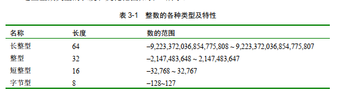

## 概述
***
java 是强语言类型的     

### 简单数据类型
***
java 定义了8个简单的数据类型：byte,short,int,long,char,float,double,boolean

**整数**：byte,short,int,long   
**浮点**：float,double(有小数精度要求的数字)
**字符**：char
**布尔**：boolean   
因为java的可移植性要求，所有数据类型都有一个严格定义的范围

#### 整数类型


**字节型**   
是最小的整数类型，它是有符号的8位类型，范围是-128~127
- 一般从网络或者文件处理数据流的时候，字节类型的变量特别有用
- 处理与java其他内置类型不直接兼容的未加工的二进制数据是，它们也是有用的  


**短整型**    
有符号的16位类型，数的范围是 -32768~32767
- 使用的比较少，这种类型比较适用于16位计算机，但是这种计算机比较少见了

**整型**    
有符号的32位类型，范围是-2,147,483,648～
2,147,483,64
- int类型的变量通常被用来控制循环及用做数组下标
- 如果整数表达式包括byte,short,int及字面量数字，所有表达式的类型都被提升到整型

**长整型**     
有符号的64位类型，它对于那些整型不足以保存所要求的数值时是非常有用的

#### 浮点型
浮点也是实数，当计算的表达是有精度要求是被使用
    

float:占用32位存储空间的单精度值
- 在一些处理器上比双精度更快，而且只占双精度一般的空间，但是值变得很大或者很小的时候，它将变得不精确

double：占用64位的存储空间
- 在一些现代的被优化用来进行高速数学计算的处理器上双精度实际上比单精度的快


#### 字符
java 中的char 是16位，具体原因可以参考```《java基础教程》```数据类型、变量章节
- char 类型可以被赋值为整数,代表那个数代表的值   

```agsl
public static void chartest(){
        char ch1,ch2;
        ch1 = 88;
        ch2 = 'Y';
        System.out.print("ch1 and ch2:");
        System.out.println(ch1 + " " + ch2);
    }
```

结果
```agsl
ch1 and ch2:X Y
```

char 类型可以相加  
```agsl
public static void charAdd(){
        char ch1;
        ch1 = 'X';
        System.out.println("ch1 is:" + ch1);
        ch1++;
        System.out.println("ch1 is now:"+ch1);

    }
```   
结果：
```agsl
ch1 is:X
ch1 is now:Y
```
#### 布尔


### 数组  
